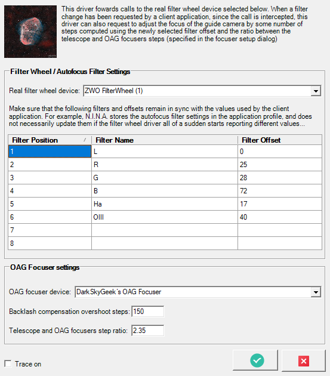
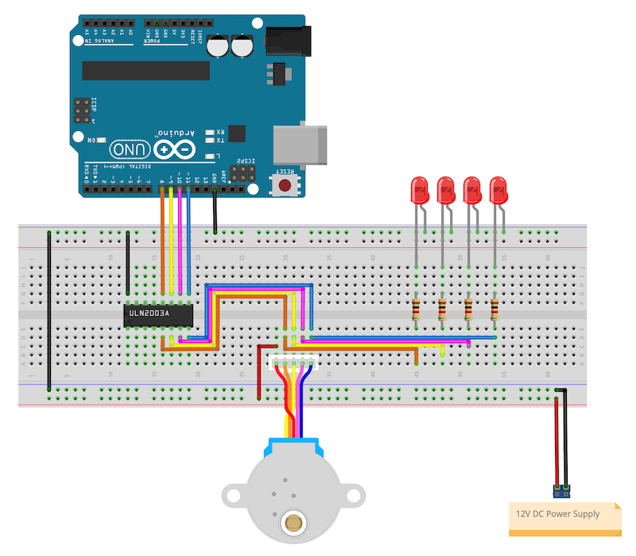
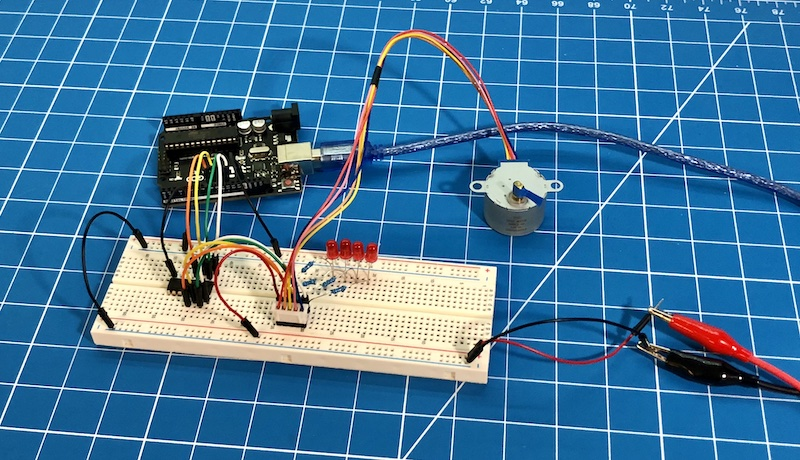
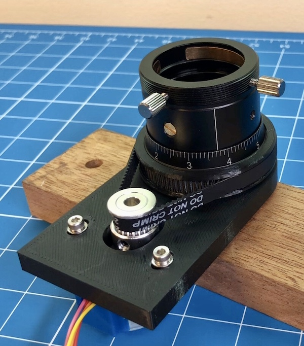
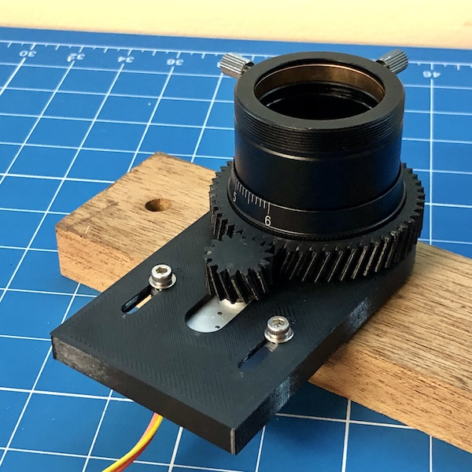
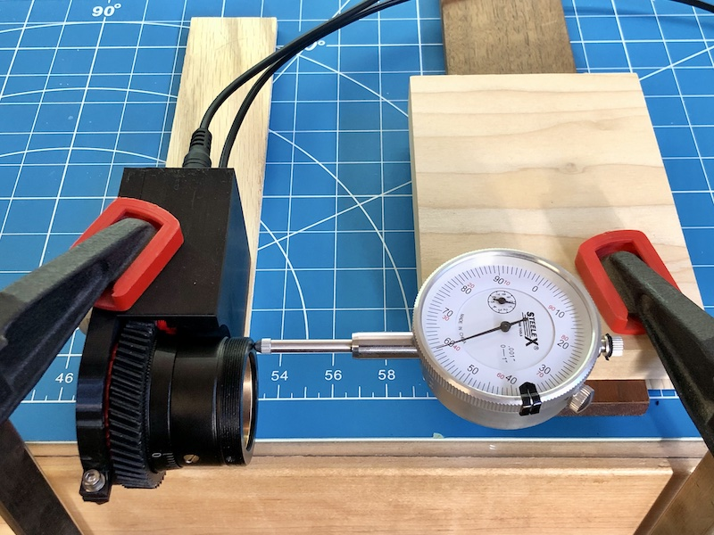

# ASCOM-Compatible OAG Focuser

<!-- toc -->

- [Introduction](#introduction)
- [Pre-Requisites](#pre-requisites)
- [Hardware](#hardware)
- [ASCOM Driver](#ascom-driver)
  - [Compiling The Driver](#compiling-the-driver)
  - [Installing The Driver](#installing-the-driver)
  - [Screenshots](#screenshots)
- [Standalone Focuser Application](#standalone-focuser-application)
- [Arduino Firmware](#arduino-firmware)
  - [Microcontroller Compatibility](#microcontroller-compatibility)
  - [Compiling And Uploading The Firmware](#compiling-and-uploading-the-firmware)
- [Electronic Circuit](#electronic-circuit)
- [Mechanical Components](#mechanical-components)
  - [Gear Drive vs Belt Drive](#gear-drive-vs-belt-drive)
  - [Backlash Measurement And Compensation](#backlash-measurement-and-compensation)
- [Frequently Asked Questions](#frequently-asked-questions)

<!-- tocstop -->

## Introduction

Shortly after I got started in astrophotography, I noticed that the stars in my images were slightly elongated due to some differential flexure somewhere in my imaging system (see [Cloudy Nights thread](https://www.cloudynights.com/topic/775260-good-guiding-but-elongated-stars-along-e-w-direction/) — I strongly suspect that it is sag in my focuser...) The permanent solution was to switch from using a guide scope to using an off-axis guider (OAG) and that immediately resolved my issue. Now, my stars are perfectly round, which is great! For reference, I purchased the [ZWO OAG](https://astronomy-imaging-camera.com/product/zwo-oag) and the accompanying [ZWO 1.25" helical focuser](https://astronomy-imaging-camera.com/product/zwo-1-25%E2%80%B3-helical-focuser).

As good as this sounds, the OAG brought a number of new challenges which I did not have to deal with before. First, when using an OAG, the field of view is very small, which sometimes makes it difficult for the guiding software to detect guide stars. Second, the OAG requires some amount of refocusing when switching filters. Indeed, filters are not always parfocal. Most importantly, a refractor (even an apochromatic refractor...) will focus various wavelengths at different distances, and this is the primary reason why it is required to change the focus of the main imaging camera (using filter offsets) when changing filters. While guiding software like PHD2 can accommodate slightly out-of-focus guide stars by computing their centroid, out-of-focus guide images can contain a drastically lower number of detected guide stars, and those that are detected will have a much lower Signal to Noise Ratio (SNR), further reducing the accuracy of the centroid computation. In some situations, PHD2 may not even be able to detect a single guide star, and guiding will be impossible. This has happened to me in the past, and I was forced to _manually_ refocus the guide camera (independently of the main imaging camera of course, using the OAG helical focuser)

Manually refocusing the guide camera throughout the night is not exactly one of the most enjoyable parts of the hobby, so I looked for ways to automate that. Pegasus Astro sells a motorized OAG named [SCOPS OAG](https://pegasusastro.com/products/scops-oag/). However, it is a little expensive for me ($750 US — although it is a really great looking unit!) Furthermore, I discussed with the [N.I.N.A.](https://nighttime-imaging.eu/) developers on their [Discord server](https://discord.gg/fwpmHU4). Since N.I.N.A. can only connect to a single focuser at a time, there is no good solution yet to deal with SCOPS OAG. It is certainly possible to run a second instance of N.I.N.A. that connects to both SCOPS OAG and the guide camera, but there is no way to have those two N.I.N.A. instances communicate to do something upon filter change.

All of this has led me to design and build my own solution to this problem. In this repository, you will find everything you need to motorize and automatically control the ZWO OAG (list of parts, 3D model, electronic schematics, Arduino firmware, ASCOM driver, standalone ASCOM client application, instructions, etc.) I hope you consider building this project if you find yourself in a similar situation. Please note that the ASCOM driver can be used with SCOPS OAG, there is nothing in the Filter Wheel Proxy implementation that is specific to my device.

If you have a question or run into a problem, don't hesitate to file a [GitHub issue](https://github.com/jlecomte/ascom-oag-focuser/issues). And of course, Pull Requests are always welcome!

## Pre-Requisites

* A Windows computer (Windows 10 or newer)
* [Microsoft Visual Studio](https://visualstudio.microsoft.com/) (FYI, I used the 2022 edition...)
* [ASCOM Platform](https://ascom-standards.org/)
* [ASCOM Platform Developer Components](https://ascom-standards.org/COMDeveloper/Index.htm)
* [Arduino IDE](https://www.arduino.cc/en/software)
* [FreeCAD](https://www.freecadweb.org/), a free and open-source 3D parametric modeler
* A 3D printer able to print PETG, and a slicer (I use a heavily upgraded Creality Ender 3 v2, and Ultimaker Cura)
* A few basic tools that any tinkerer must own, such as a breadboard, a soldering iron, etc.

## Hardware

The following are just suggestions... Also, over time, some of the links may no longer work...

* [ZWO OAG](https://astronomy-imaging-camera.com/product/zwo-oag)
* [ZWO 1.25" helical focuser](https://astronomy-imaging-camera.com/product/zwo-1-25%E2%80%B3-helical-focuser)
* Arduino-compatible microcontroller board with built-in EEPROM
* ULN2003 Darlington transistor array to control the stepper motor using the Arduino's digital I/O pins.
* 28BYJ-48 stepper motor — I picked a model that is rated for 12V, but you can also use the standard 5V model.
* LEDs — These are not required, but they can be useful to debug the firmware.
* Resistors — Any value between 1KΩ and 5KΩ should work, depending on how bright you want the LEDs.

## ASCOM Driver

### Compiling The Driver

Open Microsoft Visual Studio as an administrator (right-click on the Microsoft Visual Studio shortcut, and select "Run as administrator"). This is required because when building the code, by default, Microsoft Visual Studio will register the compiled COM components, and this operation requires special privileges (Note: This is something you can disable in the project settings...) Then, open the solution (`ASCOM_Driver\ASCOM.DarkSkyGeek.OAGFocuser.sln`), change the solution configuration to `Release` (in the toolbar), open the `Build` menu, and click on `Build Solution`. As long as you have properly installed all the required dependencies, the build should succeed and the ASCOM driver will be registered on your system. The binary file generated will be `ASCOM_Driver\bin\Release\ASCOM.DarkSkyGeek.OAGFocuser.dll`. You may also download this file from the [Releases page](https://github.com/jlecomte/ascom-oag-focuser/releases).

### Installing The Driver

If you are planning to use the ASCOM driver on a separate computer, you can install it manually, using `RegAsm.exe`. Just don't forget to use the 64 bit version, and to pass the `/tlb /codebase` flags. Here is what it looked like on my imaging mini computer:

```
> C:\Windows\Microsoft.NET\Framework64\v4.0.30319\RegAsm.exe /tlb /codebase ASCOM.DarkSkyGeek.OAGFocuser.dll
Microsoft .NET Framework Assembly Registration Utility version 4.8.4161.0
for Microsoft .NET Framework version 4.8.4161.0
Copyright (C) Microsoft Corporation.  All rights reserved.

Types registered successfully
```

### Screenshots

The ASCOM driver registers two new components: `ASCOM.DarkSkyGeek.FilterWheelProxy`, which implements the `IFilterWheelV2` ASCOM interface, and `ASCOM.DarkSkyGeek.OAGFocuser`, which implements the `IFocuserV3` ASCOM interface. Both components have their own settings dialog. Here is what the filter wheel settings dialog looks like:



And here is what the focuser settings dialog looks like:


## Standalone Focuser Application

Open the `Focuser_App\ASCOM.DarkSkyGeek.FocuserApp.sln` solution in Microsoft Visual Studio, change the solution configuration to `Release` (in the toolbar), open the `Build` menu, and click on `Build Solution`. Very simple! The binary file generated will be `Focuser_App\bin\Release\ASCOM.DarkSkyGeek.FocuserApp.exe`. You may also download this file from the [Releases page](https://github.com/jlecomte/ascom-oag-focuser/releases). Here is what that little standalone application looks like:


This application allows you to connect to and control DarkSkyGeek’s OAG focuser, and in particular, it enables you to test various backlash compensation values as well as set the zero position. If you use a SCOPS OAG, I can only assume that it came with its own standalone application with similar functionality...

## Arduino Firmware

### Microcontroller Compatibility

All Arduino-compatible microcontrollers that have a **built-in EEPROM** should work. Unfortunately, this excludes the popular [Seeeduino XIAO](https://www.seeedstudio.com/Seeeduino-XIAO-Arduino-Microcontroller-SAMD21-Cortex-M0+-p-4426.html) (one of my favorite microcontroller boards for hobby projects...) If you insist on using a unit that does not have a built-in EEPROM, you will have to customize the firmware to fit your needs. You could technically use a separate EEPROM chip, or you could use the [`FlashStorage` library](https://github.com/cmaglie/FlashStorage) or the [`FlashStorage_SAMD` library](https://github.com/khoih-prog/FlashStorage_SAMD), or you could simply disable the EEPROM code (in which case the device will not remember its last position after a power cycle...)

### Compiling And Uploading The Firmware

* If needed, add support for the board that you are using in your project.
* You may want to customize the name of the device when connected to your computer. To do that, you will have to update the appropriate `usb_product` key in the appropriate `boards.txt` file... I cannot give you specific instructions for that because they depend on the exact board you are using.
* Finally, connect your board to your computer using a USB cable, open the sketch file located at `Arduino_Firmware\Arduino_Firmware.ino`, and click on the `Upload` button in the toolbar.

## Electronic Circuit

The electronics circuit is fairly straightforward. I included a Fritzing file in the `Electronics/` folder. Here are the schematics:



Here is what the prototype circuit looks like:



## Mechanical Components

### Gear Drive vs Belt Drive

My first attempt to move the focuser with a stepper motor was done using a belt:



Unfortunately, the belt occasionally slipped, so I gave helical gears a try:



It turned out that helical gears, which are very easy to make on a 3D printer, worked absolutely flawlessly! Another thing that also helped get great results was to slightly loosen the focuser (there are 4 tiny set screws on the ZWO focuser you can loosen ever so slightly to make it easier to rotate the knurled knob) because these small stepper motors don't have that much torque...

I included both the belt and gear models in the `3D_Files/` directory so you can give them both a try and decide which one you want to use.

The "reverse rotation" checkbox in the focuser driver setup dialog window allows you to specify the direction of rotation when the number of steps increases. Check that option (default) if you chose a gear drive, and uncheck it if you chose a belt drive.

### Backlash Measurement And Compensation

There are many sources of backlash in this system. The stepper motor itself, due to its internal gearbox, already has some amount of backlash. The 3D printed gear and pinion also have some backlash. And finally, the helical focuser has some backlash as well. All of those sources combine. Thankfully, compensating for backlash is easy and supported by the software in this repository. The trick is to first measure the amount of backlash in your system. Here is how I do it using a dial indicator:



Using the standalone focuser control application, setting a backlash compensation of 0, move in one direction by a large amount. Then, repetitively move in small increments in the opposite direction until the dial indicator starts moving. In my setup, I have a total of about 60 steps of backlash, so I set the backlash compensation amount to 100 (the software uses the so-called "overshoot" backlash compensation method) and it works absolutely flawlessly!

## Frequently Asked Questions

**I built this project and it does not work, can you help?**

_Maybe. As indicated in the `LICENSE` file, I do not provide any official guarantee or support. That being said, if you open a GitHub issue in this repository and ask nicely, I will likely respond. Just make sure that you provide all the necessary details so that I understand what the issue might be. While on that note, keep in mind that troubleshooting an issue on your own is by far the best way to learn new things._

**Gear drive or belt drive? Which one do you recommend?**

_Because of the possibility of belt slippage, I recommend the gear drive. The enclosure is designed for that. A belt driven system would require minor tweaks to the enclosure, which are not hard to do in Freecad if you know a little about that software._

**Why did you not use the `Stepper` or `AccelStepper` library in the Arduino firmware?**

_It might seem strange that I decided to "manually" control the stepper motor instead of using the standard [`Stepper` library](https://www.arduino.cc/reference/en/libraries/stepper/) or the popular [`AccelStepper` library](https://www.arduino.cc/reference/en/libraries/accelstepper/). There are two reasons for that:_

1. _I need to be able to handle incoming requests while the motor is moving, e.g., `COMMAND:FOCUSER:ISMOVING`. This is not possible with any of the aforementioned libraries._
2. _To save power and to prevent heat buildup (particularly important since the motor will be inside a 3D printed enclosure), I de-energize the stepper motor by setting all the pins to LOW once it has reached the desired position. This is also not supported by any of the aforementioned libraries, and it makes a huge difference! If you don't believe me, try commenting out that part of the code, and play with the firmware for a little while (you don't even need to actively move the motor). Then, feel how hot the motor gets..._

**Why is backlash compensation not implemented in the focuser driver?**

_The software included in this repository (specifically the `FilterWheelProxy` ASCOM component) was designed and implemented so that it may be used with other OAG focusers, including commercial units such as the SCOPS OAG, and I have no idea whether their driver handles backlash compensation. This way, no matter which focuser you use to adjust the focus of your guide camera, as long as its driver implements the standard `IFocuserV3` ASCOM interface, this will work and you will enjoy the benefits of backlash compensation!_
